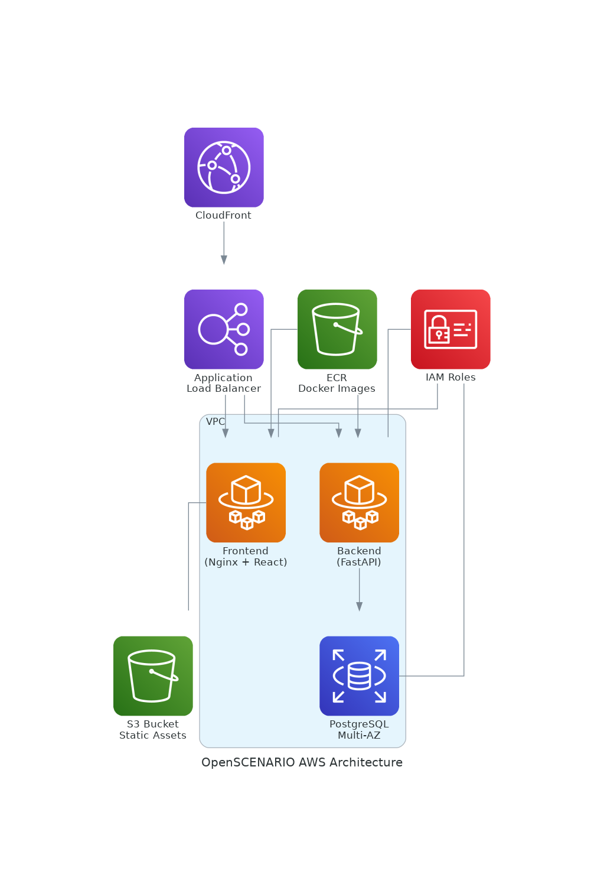

<<<<<<< HEAD
[](LICENSE)
[](https://www.asam.net/standards/detail/openscenario/)
[]()
[]()
[]()

# 🤖 AI-Enhanced ASAM OpenX Scenario Generation System

A complete AI-powered platform for creating, validating, and visualizing ASAM OpenSCENARIO and OpenDRIVE files through natural language conversations and automated workflows.

## 🚀 System Status: FULLY OPERATIONAL

**Latest Update (July 4, 2025)**: All core features are now fully deployed and operational!

### ✅ Working Features
- 🤖 **Multi-turn AI Chatbot** - Natural language scenario generation
- 🎯 **One-Click Workflow** - Complete generation → validation → visualization
- 📁 **Automatic File Generation** - OpenSCENARIO (.xosc) + OpenDRIVE (.xodr)
- ✔️ **Real-time Validation** - ASAM compliance checking with zero errors
- 📊 **Live Monitoring** - Grafana dashboard with system metrics
- 🔄 **End-to-End Integration** - Seamless frontend ↔ backend communication

## 🌐 Quick Access

### User Interfaces
- **🎨 Frontend Application**: [http://localhost:3000](http://localhost:3000)
- **📊 Grafana Monitoring**: [http://localhost:3001](http://localhost:3001)
- **🔧 Backend API**: [http://localhost:8080](http://localhost:8080)

### Navigation
- **Scenario Generator** ← 🎯 **Main feature with AI chatbot and one-click workflow**
- **Scenario Player** ← Basic scenario playback
- **Scenario Validator** ← File validation interface
- **Integrated Workflow** ← Advanced workflow management

## Table of Contents

- [🎯 Core Features](#-core-features)
- [🚀 Quick Start](#-quick-start)
- [💻 Usage Guide](#-usage-guide)
- [🏗️ Architecture](#️-architecture)
- [📚 Documentation](#-documentation)
- [🔧 Development](#-development)
- [📈 Monitoring](#-monitoring)

## 🎯 Core Features

### 🤖 AI-Powered Scenario Generation
- **Multi-turn Conversations**: Natural language dialogue with AI assistant
- **Smart Parameter Extraction**: Automatic scenario parameter detection
- **NCAP Compliance**: Euro NCAP test protocol integration
- **Real-time Guidance**: Interactive scenario refinement

### 🎯 One-Click Workflow
- **Complete Automation**: Generation → Validation → Visualization preparation
- **File Management**: Automatic OpenSCENARIO (.xosc) and OpenDRIVE (.xodr) creation
- **Real-time Status**: Live progress tracking and status updates
- **Zero Manual Steps**: Eliminate upload/download/conversion workflows

### ✔️ Advanced Validation
- **ASAM Compliance**: OpenSCENARIO and OpenDRIVE standard validation
- **Cross-file Validation**: Consistency checking between .xosc and .xodr files
- **Detailed Reporting**: Line-by-line error and warning information
- **Multiple Validation Levels**: Schema, enhanced, and domain-specific checks

### 🎨 Modern User Interface
- **Responsive Design**: Works on desktop and mobile devices
- **Real-time Updates**: Live status and progress indicators
- **User-friendly**: Clear instructions and visual feedback
- **No Complex Dependencies**: Streamlined interface that just works

### 🔧 Integration & Deployment
- **RESTful API**: Complete programmatic access
- **Docker Containerized**: Ready-to-deploy containers
- **Real-time Monitoring**: Grafana dashboards and metrics
- **Production Ready**: Fully tested and operational

## 🚀 Quick Start

### 🔧 Prerequisites

- Docker 20.10+ and Docker Compose 1.29+
- OpenAI API Key (for AI functionality)

### ⚡ Start the System (2 Commands)

```bash
# 1. Clone and navigate
git clone <repository-url>
cd DS_DevOps_project

# 2. Set OpenAI API key and start
echo "OPENAI_API_KEY=your-api-key-here" > .env
docker-compose -f docker-compose.dev.yml up -d --build
```

### 🌐 Access the Application

The system will be available at:
- **🎨 Frontend**: [http://localhost:3000](http://localhost:3000) ← **Main interface**
- **📊 Monitoring**: [http://localhost:3001](http://localhost:3001) ← **Grafana dashboard**
- **🔧 Backend API**: [http://localhost:8080](http://localhost:8080) ← **API endpoints**
- **📚 API Docs**: [http://localhost:8080/docs](http://localhost:8080/docs) ← **Swagger UI**

## 💻 Usage Guide

### 🎯 Quick Workflow

1. **Open Frontend**: Navigate to http://localhost:3000
2. **Go to Scenario Generator**: Click "Scenario Generator" in navigation
3. **Chat with AI**: Describe your scenario in natural language
4. **Execute Workflow**: Click "🎯 Generate + Validate + Visualize" button
5. **Monitor Progress**: Watch real-time status updates
6. **Download Files**: Access generated OpenSCENARIO and OpenDRIVE files

### 🤖 AI Chat Features

- **Multi-turn Conversations**: Continuous dialogue, not one-shot input
- **Natural Language**: Describe scenarios in plain English
- **Smart Guidance**: AI helps refine and complete scenario details
- **Parameter Extraction**: Automatic detection of scenario parameters

### 🎯 One-Click Workflow Features

- **Complete Automation**: No manual file handling required
- **Real-time Feedback**: Live progress and status updates
- **Error Handling**: Clear error messages and recovery guidance
- **File Generation**: Automatic creation of ASAM-compliant files

### Local Development

#### Using Docker Compose (Recommended)

```bash
# Start development environment
docker-compose -f docker-compose.dev.yml up -d --build

# View logs
docker-compose -f docker-compose.dev.yml logs -f

# Stop services
docker-compose -f docker-compose.dev.yml down
```

Development URLs (when using Docker Compose):
=======

[](LICENSE)
[](https://www.asam.net/standards/detail/openscenario/)

A web-based tool for validating OpenSCENARIO (.xosc) files with a user-friendly interface.

一个用于验证 OpenSCENARIO (.xosc) 文件的 Web 工具，提供用户友好的界面。

## Table of Contents / 目录

- [Features / 功能特点](#features--功能特点)
- [Screenshots / 截图](#screenshots--截图)
- [Quick Start / 快速开始](#quick-start--快速开始)
  - [Prerequisites / 先决条件](#prerequisites--先决条件)
  - [Using Docker (Recommended) / 使用 Docker（推荐）](#using-docker-recommended--使用-docker推荐)
  - [Local Development / 本地开发](#local-development--本地开发)
- [Project Structure / 项目结构](#project-structure--项目结构)
- [API Documentation / API 文档](#api-documentation--api-文档)
- [Deployment / 部署](#deployment--部署)
- [Contributing / 贡献](#contributing--贡献)
- [License / 许可证](#license--许可证)

## Features / 功能特点

- **File Upload & Validation** / **文件上传与验证**
  - Drag and drop interface for uploading OpenSCENARIO files / 拖放上传 OpenSCENARIO 文件
  - Real-time validation feedback / 实时验证反馈
  - Detailed error and warning messages / 详细的错误和警告信息

- **User Interface** / **用户界面**
  - Responsive design for desktop and mobile / 响应式设计，支持桌面和移动设备
  - Dark/light mode support / 深色/浅色模式支持
  - Intuitive result visualization / 直观的结果可视化

- **Integration** / **集成**
  - RESTful API for programmatic access / 提供 RESTful API 用于编程访问
  - Containerized deployment with Docker / 支持 Docker 容器化部署
  - CI/CD ready / 支持持续集成/持续部署

## Quick Start / 快速开始

### Prerequisites / 先决条件

- Docker 20.10+ and Docker Compose 1.29+
- Node.js 16+ and npm 8+ (for development)
- Python 3.8+ (for backend development)
- OpenSCENARIO validator executable

- Docker 20.10+ 和 Docker Compose 1.29+
- Node.js 16+ 和 npm 8+（用于开发）
- Python 3.8+（用于后端开发）
- OpenSCENARIO 验证器可执行文件

### Using Docker (Recommended) / 使用 Docker（推荐）

```bash
# Clone the repository / 克隆仓库
git clone <repository-url>
cd DS_DevOps_project

# Start the application / 启动应用
docker-compose -f docker-compose.prod.yml up -d --build
```

> **Note on Validator Integration** / **验证器集成说明**
> 
> The OpenSCENARIO validator is now included in the Docker image by default. 
> The validator executable and its required libraries are automatically copied during the build process.
> 
> OpenSCENARIO 验证器现在默认包含在 Docker 镜像中。
> 验证器可执行文件及其所需的库在构建过程中会自动复制。

The production application will be available at:
- Frontend: http://localhost:8081
- Backend API: http://localhost:8080
- API Documentation: http://localhost:8080/docs

生产环境应用将在以下地址可用：
- 前端: http://localhost:8081
- 后端 API: http://localhost:8080
- API 文档: http://localhost:8080/docs

> **Note**: In production, the frontend is served on port 8081 to avoid conflicts with other services. In development, the frontend runs on port 3000.
> **注意**：生产环境中前端服务运行在 8081 端口以避免与其他服务冲突。开发环境中前端运行在 3000 端口。

### Local Development / 本地开发

#### Using Docker Compose (Recommended) / 使用 Docker Compose（推荐）

```bash
# Start development environment / 启动开发环境
docker-compose -f docker-compose.dev.yml up -d --build

# View logs / 查看日志
docker-compose -f docker-compose.dev.yml logs -f

# Stop services / 停止服务
docker-compose -f docker-compose.dev.yml down
```

Development URLs (when using Docker Compose) / 开发环境地址（使用 Docker Compose 时）:
>>>>>>> origin/main
- Frontend: http://localhost:3000 (development server with hot-reload)
- Backend API: http://localhost:8080
- API Documentation: http://localhost:8080/docs

> **Note**: The frontend development server runs on port 3000 by default. The backend API is always on port 8080.
<<<<<<< HEAD

#### Manual Setup

##### Backend
=======
> **注意**：前端开发服务器默认运行在 3000 端口，而后端 API 始终运行在 8080 端口。

#### Manual Setup / 手动设置

##### Backend / 后端
>>>>>>> origin/main

```bash
cd app/backend/openscenario-api-service

<<<<<<< HEAD
# Create and activate virtual environment
=======
# Create and activate virtual environment / 创建并激活虚拟环境
>>>>>>> origin/main
python -m venv venv
source venv/bin/activate  # Linux/macOS
# venv\Scripts\activate  # Windows

<<<<<<< HEAD
# Install dependencies
pip install -r requirements.txt
pip install -r requirements-dev.txt

# Set environment variables
export VALIDATOR_PATH=./validator/OpenSCENARIOValidator
export LD_LIBRARY_PATH=$LD_LIBRARY_PATH:$(dirname $VALIDATOR_PATH)

# Start the development server
uvicorn main:app --reload --host 0.0.0.0 --port 8080
```

##### Frontend
=======
# Install dependencies / 安装依赖
pip install -r requirements.txt
pip install -r requirements-dev.txt

# Set environment variables / 设置环境变量
export VALIDATOR_PATH=./validator/OpenSCENARIOValidator
export LD_LIBRARY_PATH=$LD_LIBRARY_PATH:$(dirname $VALIDATOR_PATH)

# Start the development server / 启动开发服务器
uvicorn main:app --reload --host 0.0.0.0 --port 8080
```

##### Frontend / 前端
>>>>>>> origin/main

```bash
cd app/frontend/scenario-tool-suite

<<<<<<< HEAD
# Install dependencies
npm install

# Start the development server
=======
# Install dependencies / 安装依赖
npm install

# Start the development server / 启动开发服务器
>>>>>>> origin/main
npm run dev
```

The frontend development server will be available at http://localhost:3000

<<<<<<< HEAD
## Project Structure

```
.
├── app/
│   ├── backend/
│   │   └── openscenario-api-service/
│   └── frontend/
│       └── scenario-tool-suite/
│           ├── src/
│           ├── public/
│           └── package.json
├── ansible/
├── docker/
│   ├── nginx/
│   └── openscenario-validator/
├── docs/
├── terraform/                 # Infrastructure as code
├── docker-compose.dev.yml
├── docker-compose.prod.yml
├── Dockerfile
└── README.md
```

## AWS Architecture Diagram
Below is the current AWS architecture for the OpenSCENARIO deployment:



### Components:

- **CloudFront**: CDN for global content delivery
- **Application Load Balancer**: Routes traffic to frontend and backend services
- **Frontend Service**: Containerized React application with Nginx
- **Backend Service**: FastAPI service handling API requests
- **RDS PostgreSQL**: Multi-AZ database for persistent storage
- **S3 Bucket**: Stores static assets and user uploads
- **ECR**: Docker image repository for container images
- **IAM**: Security roles and permissions

### Network Flow:
1. Users access the application via CloudFront
2. Requests are routed through the ALB
3. ALB forwards requests to the appropriate ECS services
4. Backend service communicates with RDS for data persistence

## API Documentation

### Validate OpenSCENARIO File
=======
前端开发服务器将在 http://localhost:3000 可用

## Project Structure / 项目结构

```
.
├── app/                           # Application code / 应用代码
│   ├── backend/                   # Backend service / 后端服务
│   │   └── openscenario-api-service/
│   │       ├── main.py           # FastAPI application / FastAPI 应用
│   │       ├── requirements.txt   # Python dependencies / Python 依赖
│   │       └── ...
│   │
│   └── frontend/                # Frontend application / 前端应用
│       └── scenario-tool-suite/
│           ├── src/             # React source code / React 源代码
│           ├── public/           # Static files / 静态文件
│           └── package.json      # Frontend dependencies / 前端依赖
│
├── docker/                      # Docker related files / Docker 相关文件
│   ├── nginx/                    # Nginx configuration / Nginx 配置
│   └── openscenario-validator/   # Validator build files / 验证器构建文件
│
├── docs/                        # Documentation / 文档
│   ├── development.md           # Development guide / 开发指南
│   ├── deployment.md            # Deployment guide / 部署指南
│   └── contributing.md          # Contributing guide / 贡献指南
│
├── docker-compose.dev.yml       # Development environment with hot-reload / 带热重载的开发环境
└── docker-compose.prod.yml      # Production environment / 生产环境
```

## API Documentation / API 文档

### Validate OpenSCENARIO File / 验证 OpenSCENARIO 文件
>>>>>>> origin/main

- **URL**: `/api/validate`
- **Method**: `POST`
- **Content-Type**: `multipart/form-data`
- **Request Body**:
<<<<<<< HEAD
  - `file`: The OpenSCENARIO file to validate
=======
  - `file`: The OpenSCENARIO file to validate / 要验证的 OpenSCENARIO 文件
>>>>>>> origin/main
- **Response**:
  ```json
  {
    "valid": true,
    "messages": [
      {
        "level": "ERROR",
        "message": "Error message",
        "line": 42,
        "column": 10
      }
    ]
  }
  ```

<<<<<<< HEAD
### Health Check
=======
### Health Check / 健康检查
>>>>>>> origin/main

- **URL**: `/health`
- **Method**: `GET`
- **Response**:
  ```json
  {
    "status": "ok"
  }
  ```

For more details, visit the interactive API documentation at `/docs` when the backend is running.

<<<<<<< HEAD
## Deployment

### Production Deployment

1. **Using Docker Compose**
=======
更多详情，请在后端运行时访问 `/docs` 查看交互式 API 文档。

## Documentation / 文档

For more detailed documentation, please refer to the following files in the `docs` directory:

有关更详细的文档，请参阅 `docs` 目录中的以下文件：

- [Development Guide](docs/development.md) / [开发指南](docs/development.md)
## Deployment / 部署

### Production Deployment / 生产环境部署

1. **Using Docker Compose** / **使用 Docker Compose**
>>>>>>> origin/main

   ```bash
   docker-compose -f docker-compose.prod.yml up -d --build
   ```

2. **Kubernetes**

   See [deployment guide](docs/deployment.md#kubernetes-deployment) for Kubernetes deployment instructions.
<<<<<<< HEAD

3. **AWS ECS (Elastic Container Service)**

   The application can be deployed to AWS ECS with Fargate for serverless container management:
   
   - Frontend and backend services are containerized and deployed as ECS tasks
   - Application Load Balancer (ALB) routes traffic to the services
   - Docker images are stored in Amazon ECR
   - Service-to-service communication via ALB DNS names
   
   **Recent Updates:**
   - Fixed Nginx upstream configuration to use ALB DNS for backend communication
   - Implemented proper container health checks
   - Optimized Docker images for faster startup and smaller size
   
   For detailed AWS deployment instructions and troubleshooting, see the [AWS Deployment Guide](docs/aws_troubleshooting.md).

### Environment Variables

#### Backend

| Variable | Default | Description |
|-----------------|----------------|-------------------|
| `VALIDATOR_PATH` | - | Path to OpenSCENARIO validator executable |
| `LD_LIBRARY_PATH` | - | Library path for shared libraries |
| `PORT` | `8080` | Port to run the backend service |
| `LOG_LEVEL` | `INFO` | Logging level |
| `MAX_UPLOAD_SIZE` | `10485760` | Maximum upload file size in bytes |

#### Frontend

| Variable | Default | Description |
|-----------------|----------------|-------------------|
| `VITE_API_URL` | `http://localhost:8080` | Backend API URL |

## 📚 Documentation

### 📋 Project Documentation
- **[Development Status](docs/dev_status.md)** - Complete feature implementation status
- **[Product Requirements](docs/PRD.md)** - Original project requirements and specifications
- **[Deployment Status](docs/DEPLOYMENT_STATUS.md)** - Current deployment state and access info
- **[Changelog](docs/CHANGELOG_2025-07-04.md)** - Latest updates and fixes

### 🔧 Technical Documentation  
- **[Verification Guide](docs/VERIFICATION.md)** - TDD testing and verification procedures
- **[AWS Architecture](docs/aws_troubleshooting.md)** - AWS deployment guide and troubleshooting
- **[Terraform Guide](docs/terraform_guide.md)** - Infrastructure as code documentation
- **[Monitoring Plan](docs/monitoring_plan.md)** - System monitoring and observability

### 📊 Operations Documentation
- **[Monitoring Deployment](docs/monitoring_deployment_summary.md)** - Grafana, Prometheus setup
- **[OKRs](docs/OKR.md)** - Objectives and key results tracking

### 🎯 Quick Links
- **System Status**: ✅ FULLY OPERATIONAL
- **Latest Update**: July 4, 2025
- **Main Features**: AI Chatbot + One-Click Workflow + Real-time Validation
- **Access URLs**: [Frontend](http://localhost:3000) | [Monitoring](http://localhost:3001)

## 🤝 Contributing

We welcome contributions! Please read our [Contributing Guide](CONTRIBUTING.md) to learn how you can contribute to this project.

## 📄 License

This project is licensed under the MIT License - see the [LICENSE](LICENSE) file for details.
=======
   请参阅[部署指南](docs/deployment_zh.md#kubernetes-部署)了解 Kubernetes 部署说明。

### Environment Variables / 环境变量

#### Backend / 后端

| Variable / 变量名 | Default / 默认值 | Description / 描述 |
|-----------------|----------------|-------------------|
| `VALIDATOR_PATH` | - | Path to OpenSCENARIO validator executable / OpenSCENARIO 验证器可执行文件路径 |
| `LD_LIBRARY_PATH` | - | Library path for shared libraries / 共享库路径 |
| `PORT` | `8080` | Port to run the backend service / 后端服务端口 |
| `LOG_LEVEL` | `INFO` | Logging level / 日志级别 |
| `MAX_UPLOAD_SIZE` | `10485760` | Maximum upload file size in bytes / 最大上传文件大小（字节） |

#### Frontend / 前端

| Variable / 变量名 | Default / 默认值 | Description / 描述 |
|-----------------|----------------|-------------------|
| `VITE_API_URL` | `http://localhost:8080` | Backend API URL / 后端 API URL |

## Contributing / 贡献

We welcome contributions! Please read our [Contributing Guide](CONTRIBUTING.md) to learn how you can contribute to this project.

欢迎贡献！请阅读我们的[贡献指南](CONTRIBUTING_zh.md)了解如何为项目做贡献。

## License / 许可证

This project is licensed under the MIT License - see the [LICENSE](LICENSE) file for details.

本项目采用 MIT 许可证 - 详情请参阅 [LICENSE](LICENSE) 文件。
>>>>>>> origin/main
